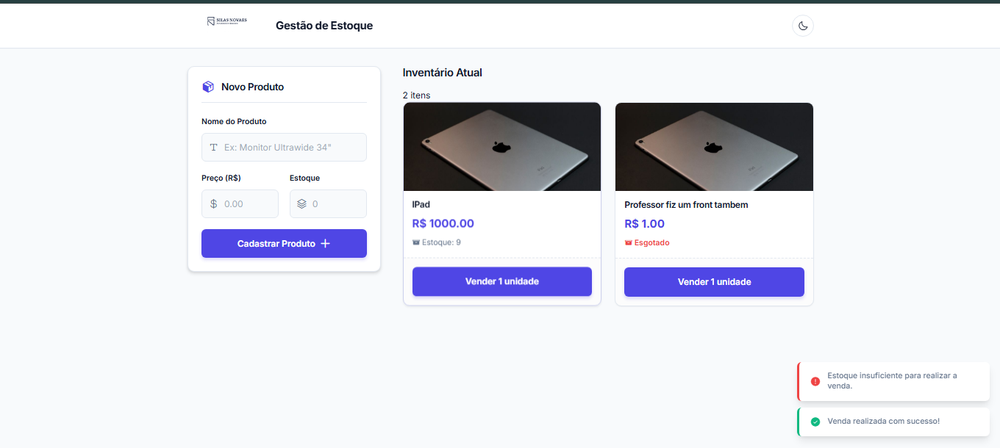

Guia de Execução e Avaliação - Sistema de Gestão de Estoque
Prezado Prof. Angelo Dias,

Abaixo estão as instruções detalhadas para executar e avaliar o projeto da disciplina de Padrões de Projeto. A arquitetura foi desenvolvida com foco em desacoplamento (API-First), utilizando Spring Boot no Backend e JavaScript Moderno (ES6 Modules) com arquitetura ITCSS no Frontend.

Pré-requisitos de Ambiente
JDK 17 configurado na IDE.

VS Code com a extensão Live Server instalada.

⚙️ Passo 1: Inicializando o Backend (API)
No IntelliJ IDEA, vá em File > Open e selecione exclusivamente a pasta backend. (Isso evita que a IDE se confunda com os arquivos estáticos do front).

Aguarde o Maven sincronizar as dependências.

Navegue até src/main/java/br/com/silasnovaes/estoque e execute a classe principal EstoqueApplication.java.

O servidor Tomcat embutido iniciará na porta 8080. O banco de dados utilizado é o H2 (in-memory), portanto, o estado do estoque é reiniciado a cada nova execução da API.

🖥️ Passo 2: Inicializando o Frontend (Interface)
Abra uma nova janela do VS Code e arraste exclusivamente a pasta frontend para dentro dela.

Localize o arquivo index.html.

Clique com o botão direito sobre o arquivo e selecione "Open with Live Server" (ou use o atalho "Go Live" na barra inferior).

O navegador abrirá a interface automaticamente (geralmente na porta 5500) já se comunicando com o backend.

🧪 O que avaliar (Funcionalidades e UX)
Integração Real: Cadastre um novo produto na interface. Você pode testar dando um F5 na página para confirmar que os dados estão sendo persistidos no banco H2 e não apenas em memória no navegador.

Regras de Negócio e Feedback Visual: Ao realizar vendas (baixa de estoque), observe os Toasts de notificação BEM-estruturados. Repare também que os cards dos produtos mudam de cor dinamicamente se o estoque ficar Baixo (amarelo) ou Esgotado (vermelho).

Tratamento de CORS: A comunicação Cross-Origin foi tratada nativamente na configuração do Spring Boot para aceitar as requisições do Live Server.

🌙 Avaliação Especial: UI/UX e Dark Mode
Para avaliar a flexibilidade do Design System e o uso de CSS Variables aplicadas ao DOM:

Por favor, abra o Developer Tools do navegador (pressionando F12) e deixe na aba Console.

Na interface do sistema, clique no botão superior de Alternância de Tema (Dark Mode).

Além de avaliar a transição fluida do layout para o modo escuro ("Dashboard SaaS Premium"), confira o registro que deixei no console especialmente para esta avaliação!

Fico à disposição para qualquer dúvida sobre a implementação ou arquitetura de código.

Atenciosamente,
Silas Novaes

Print da execução:
